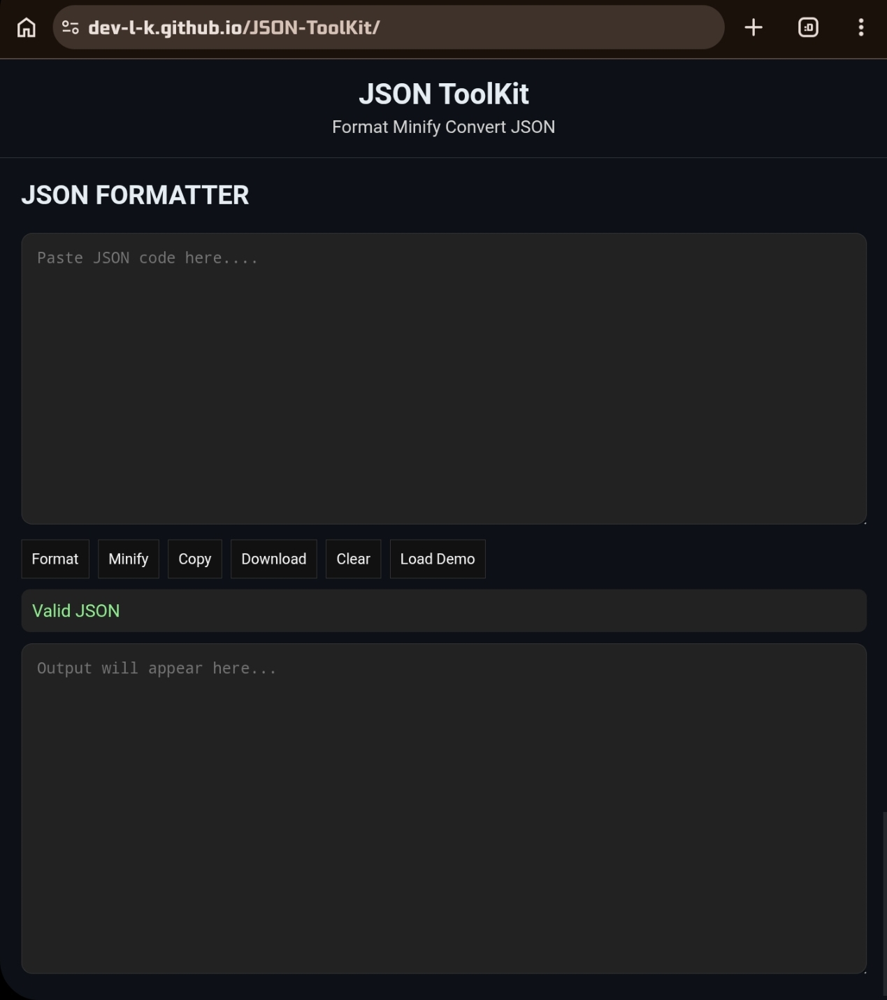

# JSON-ToolKit
---

---
This is a simple web app that will be useful for some devlopers working with apis and jsons. 
---
## **It has 2 Tools**
### JSON Formatter
This tool converts messy and large 1 line json to correctly structured json.
### JSON Minifier
This tool helps to convert convert large structured jsons to a single line json.
---
## Tech Stack
- **HTML**  To give structure to the website.
- **CSS**  To give the webpage designs and styles.
- **JS**  To make the page completely working by using logics.
--- 
## How it was made
It is completely devloped by me using just html css and js. Using prebuilt codes in the js to convert JSONs.

Problems fixed:-
- coverting messy json codes into strctured ones are a long time consuming jobe;
- Also make structured json codes into minfied single line codes.
---
## How to run

First clone my repo to your local folder by using this command.
 
` git clone https://github.com/dev-l-k/JSON-ToolKit.git `

Then directly open the `index.html` in your browser.

## Demo Link

[Try my Project by clicking here](https://dev-l-k.github.io/JSON-ToolKit/)

## AI usage
I didn't used direct ai in this. To be honest i used ai to learn about downloading json file only. i studied it and write my code my own.